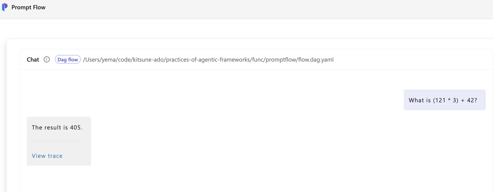
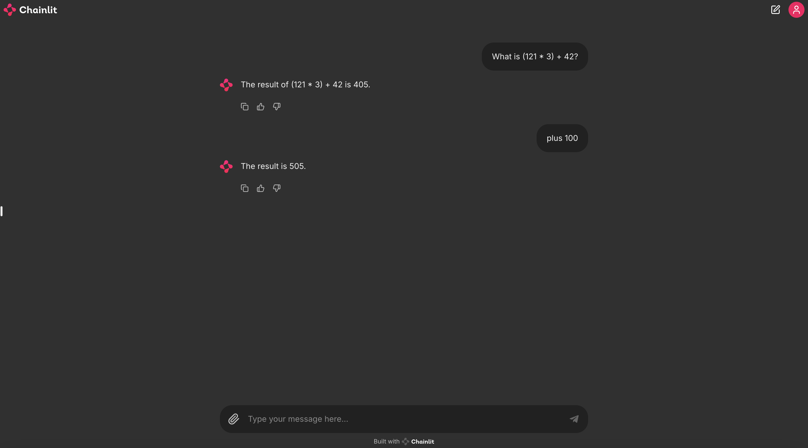
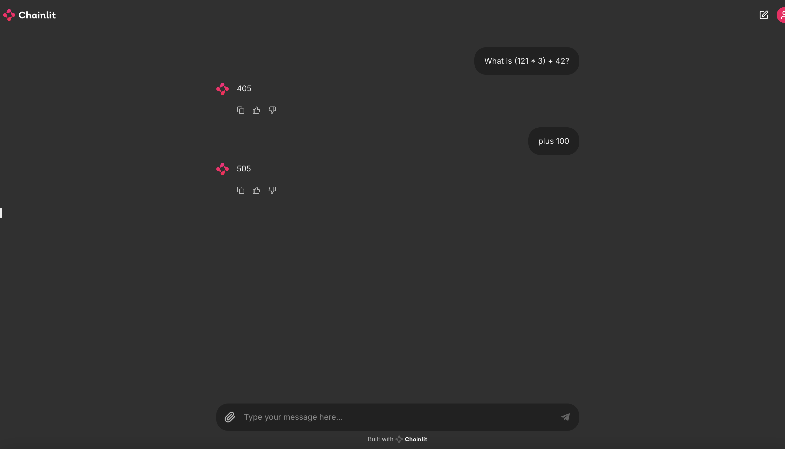

# Practices of Agentic Frameworks

## Introduction

AI Agent is an intelligent agent that uses large language models, combined with existing knowledge bases, APIs, and the coding capabilities of large language models. It has been proven that these intelligent agents can help us complete some complex tasks.

With the popularity of intelligent agents, in order to simplify their development, some open-source frameworks have emerged in the open-source community. Here we introduce some of the open-source frameworks and provide examples of common scenarios.


- [Promptflow](https://microsoft.github.io/promptflow/)
    > Prompt flow is a suite of development tools designed to streamline the end-to-end development cycle of LLM-based AI applications, from ideation, prototyping, testing, evaluation to production deployment and monitoring. It makes prompt engineering much easier and enables you to build LLM apps with production quality.

- [LangChain](https://python.langchain.com/v0.2/docs/introduction/)
    > LangChain is a framework designed to simplify the creation of applications using large language models (LLMs). As a language model integration framework, LangChain's use-cases largely overlap with those of language models in general, including document analysis and summarization, chatbots, and code analysis.

- [LlamaIndex](https://docs.llamaindex.ai/en/stable/)
    > LlamaIndex is a framework for building context-augmented generative AI applications with LLMs.

 We will demonstrate the development practices of these frameworks in 
 - Chatbot
 - Function Invocation
 - Retrieval-Augmented Generation(RAG)


## Chatbot

### Promptflow

Here is [an example](https://github.com/microsoft/promptflow/tree/main/examples/flows/chat/chat-basic) of a basic chatbot using Promptflow. 


We can see that the application of Promptflow orchestrates the conversation flow through a yaml file. In this example, it contains two input items, the history of the conversation and the question, and an output item, which is the answer to the question.

```yaml
inputs:
  chat_history:
    type: list
    default: []
  question:
    type: string
    is_chat_input: true
    default: What is ChatGPT?
outputs:
  answer:
    type: string
    reference: ${chat.output}
    is_chat_output: true
```

It is an simple example, the whole flow only contains one node, which is a chat node. We name this node as 'chat', and the type is 'llm'.


The input of this node contains the parameters related to the LLM model, such as the model name, the maximum number of tokens, the temperature, etc., as well as the chat history and question passed from the previous node, which is the entrance of the conversation.


The source represents how the prompt of this node is generated, which is generated through a jinja2 template file here. Combined with the content of the yaml file, we can see how the template file generates the conversation. The jinja template uses two variables, chat_history and question, to generate the prompt.

```yaml
  inputs:
    deployment_name: gpt-4o
    model: gpt-4o
    max_tokens: "1024"
    temperature: "0.7"
    chat_history: ${inputs.chat_history}
    question: ${inputs.question}
  name: chat
  type: llm
  source:
    type: code
    path: chat.jinja2
  api: chat
  connection: open_ai_connection
```

jinjia2 template

```jinja2
# system:
You are a helpful assistant.


# user:
{{item.inputs.question}}
# assistant:
{{item.outputs.answer}}


# user:
{{question}}
```

In this example, we use a connection configuration named open_ai_connection to configure the OpenAI link information.

In the local development environment, we can create it through the command-line tool provided by Promptflow.

Here is an example of creating a connection configuration with azure openai.

```shell
# Override keys with --set to avoid yaml file changes
pf connection create --file ./connections/azure_openai.yml --set api_key=<your_api_key> api_base=<your_api_base> --name open_ai_connection
```

An example to create a connection configuration with openai.

```shell
# Override keys with --set to avoid yaml file changes
pf connection create --file ../../connections/openai.yml --set api_key=<your_api_key> --name open_ai_connection
```


The above command creates a connection configuration named open_ai_connection through a file named azure_openai.yml and our api_key and api_base.

```yaml
$schema: https://azuremlschemas.azureedge.net/promptflow/latest/AzureOpenAIConnection.schema.json
name: open_ai_connection
type: azure_open_ai
api_key: "<user-input>"
api_base: "aoai-api-endpoint"
api_type: "azure"
```


We also need a requirements.txt file to specify the dependencies.

```txt
promptflow
promptflow-tools
```

You can find the complete code example in this [directory](./chatbot/promptflow/).


Here is the complete command to start this chatbot.

```shell
# Create a virtual environment and install dependencies
python3 -m venv .venv
# Activate the virtual environment
source .venv/bin/activate
# Install dependencies
cd chatbot/promptflow
pip install -r requirements.txt
# Create the connection
pf connection create --file ../../connections/azure_openai.yml --set api_key=<your_api_key>  api_base=<your_api_base> --name open_ai_connection
# Run the flow locally
pf flow test --flow . --interactive --ui
```

You can open the URL show in the console with your browser to interact with the chatbot.


### LangChain

Compared with Promptflow, AutoGen is more code-oriented. In this example, we can see that the chatbot is implemented in a Python script. It looks like simpler than Promptflow. But it cna only run in terminal.

```python
llm = AzureChatOpenAI(
    openai_api_key=os.environ["OPENAI_API_KEY"],     
    openai_api_type=os.environ["OPENAI_API_TYPE"],
    openai_api_version=os.environ["OPENAI_API_VERSION"],
    azure_endpoint=os.environ["AZURE_OPENAI_ENDPOINT"],  
    deployment_name=os.environ["CHAT_MODEL_DEPLOYMENT_NAME"], 
    temperature=0,
)

prompt = ChatPromptTemplate.from_messages(
    [
        ("system", "You are smart agent to answer any question."),
        ("user", "{input}"),
    ]
)

chain = LLMChain(llm=llm, prompt=prompt, output_key="metrics")
res = chain({"input": "What is ChatGPT?"})
print(res["metrics"])
```

It initializes an AzureChatOpenAI object, which is a wrapper of the Azure OpenAI API. From this example, we can also find LangChain has good support for prompt generation. LLMChain is a class that can be used to chain the LLM model and the prompt together. 

And here is an experiment to integrate the LangChain chatbot with Promptflow, so that we can leverage Promptflow UI to run LangChain application.

Here we use the Promptflow tool to make the LangChain chatbot as a task of the flow. You can find more information about the Promptflow tool in later chapters.

```python
# Create a MessagesPlaceholder for the chat history
history_placeholder = MessagesPlaceholder("history")

# Construct the prompt template
prompt_template = ChatPromptTemplate.from_messages([
    ("system", "You are smart agent to answer any question."),
    history_placeholder,
    ("user", "{input}")
])
    
@tool
def langhcian_task(question : str, chat_history : list) -> str:
    chain = LLMChain(llm=llm, prompt=prompt_template, output_key="metrics")
    res = chain({"input": question, "history": format_chat_history(chat_history)})
    return res["metrics"]
    
def format_chat_history(chat_history):
    formatted_chat_history = []
    for message in chat_history:
        if "inputs" in message:
            formatted_chat_history.append(("user", message["inputs"]["question"]))
        if "outputs" in message:
            formatted_chat_history.append(("system", message["outputs"]["answer"]))
    return formatted_chat_history
```

And the flow.dag.yml file is like this.

```yaml
$schema: https://azuremlschemas.azureedge.net/promptflow/latest/Flow.schema.json
environment:
  python_requirements_txt: requirements.txt
inputs:
  chat_history:
    type: list
    default: []
  question:
    type: string
    is_chat_input: true
    default: What is ChatGPT?
outputs:
  answer:
    type: string
    reference: ${langchain_task.output}
    is_chat_output: true
nodes:
- name: langchain_task
  type: python
  source:
    type: code
    path: langchain_task.py
  inputs:
    question: ${inputs.question}
    chat_history: ${inputs.chat_history}
```

You can find the complete code example in this [directory](./chatbot/langchain/).

Here is the command to start this chatbot which is the same as the Promptflow chatbot.

```shell
# Run the flow locally
pf flow test --flow . --interactive --ui
```

### LlamaIndex

The chatbot based on LlamaIndex is also implemented in a Python script. It is similar to LangChain.

```python
llm = AzureOpenAI(
    model="gpt-4o",
    deployment_name=os.environ["CHAT_MODEL_DEPLOYMENT_NAME"],
    api_key=os.environ["OPENAI_API_KEY"],
    azure_endpoint=os.environ["AZURE_OPENAI_ENDPOINT"],
    api_version=os.environ["OPENAI_API_VERSION"],
)

chat_engine = SimpleChatEngine.from_defaults(llm=llm)

response = chat_engine.chat(
    "What is ChatGPT?"
)
print(response)
```

And we can also integrate the LlamaIndex chatbot with Promptflow.

```python
llm = AzureOpenAI(
    model="gpt-4o",
    deployment_name=os.environ["CHAT_MODEL_DEPLOYMENT_NAME"],
    api_key=os.environ["OPENAI_API_KEY"],
    azure_endpoint=os.environ["AZURE_OPENAI_ENDPOINT"],
    api_version=os.environ["OPENAI_API_VERSION"],
)
    
chat_engine = SimpleChatEngine.from_defaults(llm=llm)

@tool
def llama_task(question : str) -> str:
    response = chat_engine.chat(
        question
    )
    return response.response
```

And the flow.dag.yml file is like this.

```yaml
$schema: https://azuremlschemas.azureedge.net/promptflow/latest/Flow.schema.json
environment:
  python_requirements_txt: requirements.txt
inputs:
  question:
    type: string
    is_chat_input: true
    default: What is ChatGPT?
outputs:
  answer:
    type: string
    reference: ${llamaindex_task.output}
    is_chat_output: true
nodes:
- name: llamaindex_task
  type: python
  source:
    type: code
    path: llamaindex_task.py
  inputs:
    question: ${inputs.question}
```

Here is the command to start this chatbot which is the same as the Promptflow and LangChain chatbot.

```shell
# Run the flow locally
pf flow test --flow . --interactive --ui
```

You may find the chatbot based on LlamaIndex supports chat history by default.

## Function Invocation

Although we know that LLM can be used to generate and execute code, it would be more convenient if we can directly provide some functions and let LLM execute them.

In the following chapters, we will introduce how to use Promptflow, LangChain, and LlamaIndex to implement function invocation. We hope our chatbot can complete a math question below:

__What is (121 * 3) + 42?__

### Promptflow + AutoGen


We found that although Promptflow provides a node that can execute Python code, we have already used this feature to integrate with LangChain and LlamaIndex above. However Promptflow does not provide the function to automatically recognize and call functions.

So we either implement a node ourselves to determine whether and which function should be called, or we can use another framework called [AutoGen](https://microsoft.github.io/autogen/) to complete this task. And AutoGen can be easily integrated with Promptflow.

> AutoGen offers a unified multi-agent conversation framework as a high-level abstraction of using foundation models. It features capable, customizable and conversable agents which integrate LLMs, tools, and humans via automated agent chat. By automating chat among multiple capable agents, one can easily make them collectively perform tasks autonomously or with human feedback, including tasks that require using tools via code.

<!-- translate in English -->

AutoGen provides an encapsulation class AssistantAgent to simplify the development of agents. We only need to provide the name, description, system message, and llm configuration to complete a simple agent implementation.

```python
self.mathAssistant = AssistantAgent(
    name="MathAssistant",
    system_message="""You are a smart assistant, you can help with math problems with the tool provided.
If you solve the problem, return a result and end 'TERMINATE' in new line, when you complete the task successfully.
If you cannot solve the problem, return a message of the reason and end 'TERMINATE' in new line.""",
    description="Math Assistant",
    llm_config=self.llm_config)
```

We also need to create a UserProxy Agent, which is mainly used to execute the Python functions we provide in our example.


```python
self.user_proxy = UserProxyAgent(
            name="User",
            llm_config=False,
            is_termination_msg=lambda msg: msg.get("content") is not None and "TERMINATE" in msg["content"],
            human_input_mode="NEVER"
        )
```

<!-- translate in English -->

Then we can see what Python functions we need to provide to implement a math calculation Agent. We only use addition as an example.


```python
def plus(a: int, b: int) -> int:
    return a + b

register_function(
    plus,
    caller=self.mathAssistant,  # The assistant agent can suggest calls to the calculator.
    executor=self.user_proxy,  # The user proxy agent can execute the calculator calls.
    name="plus",  # By default, the function name is used as the tool name.
    description="A plus calculation tool",  # A description of the tool.
)
```

We can see that we first define an addition function, and then register it to mathAssistant through the register_function function. That is, mathAssistant will decide when to call this function, and user_proxy will execute this function.

Next, we create a group chat and a group chat manager and put the two agents into the group chat.

```python
self.groupchat = GroupChat(agents=[self.user_proxy, self.mathAssistant], messages=[], max_round=12)
self.manager = GroupChatManager(groupchat=self.groupchat, llm_config=self.llm_config)
```

The chat manager will manage the conversation between the two agents by select which agent will handle next message.

Finally, we can start the chat. Here we provide a method.

```python
def chat(self, question: str, chat_history: list) -> str:
    res = self.user_proxy.initiate_chat(
            self.manager, message=question,
    )
    return res.summary
```

This method will be invoked in the Promptflow task node, as below.

```python
agent = AutoGenChat()
        
@tool
def autogen_task(question : str, chat_history : list) -> str:
    answer = agent.chat(question, chat_history)
    return answer
```

> We pass the chat history to the chat method, but we have not used it in this example. We can use it to record the conversation history and provide context for the conversation.

Here is a screenshot of the UI.



You can find the complete code example in this [directory](./func/promptflow/).

### LangChain

Now we will introduce how to implement the math calculation agent using LangChain.

```python
from langchain_core.tools import tool

@tool
def add(a: int, b: int) -> int:
    """Adds a and b.

    Args:
        a: first int
        b: second int
    """
    return a + b
tools.append(add)
```

We need to define the add function and use the @tool decorator to register it as a tool. The tool is a mechanism in LangChain to manage the functions that can be called by the LLM model. 

The tools.append(add) is used to append the function to the tools list.

```python
from langchain.agents import AgentExecutor, create_tool_calling_agent

agent = create_tool_calling_agent(llm, tools, prompt_template)
self.agent_executor = AgentExecutor(agent=agent, tools=tools, verbose=True)
```

The code above show how to create an agent with the tools we defined. The agent_executor is used to execute the agent.

```python
def execute(self, question: str, chat_history: list) -> str:
  res = self.agent_executor.invoke({"input": question, "history": chat_history})
  return res["output"]
```

We provide a method to execute the agent. The method will be invoked by external code.

This time, we use another framework called [Chainlit](https://github.com/Chainlit/chainlit) as the front-end to interact with the LangChain agent.

> We will not introduce the details of Chainlit here. You can learn more about it in [the official documentation](https://docs.chainlit.io/get-started/overview).

```python
import chainlit as cl
from agent import LangChainMathAgent

@cl.on_chat_start
async def on_chat_start():
    agent = LangChainMathAgent()
    cl.user_session.set("prompt_history",[])
    cl.user_session.set("agent", agent)


@cl.on_message
async def on_message(message: cl.Message):
    agent = cl.user_session.get("agent")  # type: LangChainMathAgent
    prompt_history = cl.user_session.get("prompt_history")  # type: list
    res = agent.execute(message.content, prompt_history)
    prompt_history.append(("user", message.content))
    prompt_history.append(("system", res))
    await cl.Message(content=res).send()
```

Chainlit provide a pure Python way to interact with the LangChain agent. We initialize the agent and the prompt history in the on_chat_start function. And we use the on_message function to handle the message from the user.

```shell
chainlit run app.py
```
Here is the screenshot of the UI.



You can find the complete code example in this [directory](./func/langchain/).

### LlamaIndex

We can also implement the math calculation agent using LlamaIndex.

```python
from llama_index.core.tools import FunctionTool

def add(a: int, b: int) -> int:
    """Add two integers and returns the result integer"""
    return a + b


add_tool = FunctionTool.from_defaults(fn=add)

self.agent = ReActAgent.from_tools([multiply_tool, add_tool, minus_tool, divide_tool], llm=llm, verbose=True)
```

From the code above, we can see that we define an add function and then leverage the FunctionTool provided by LlamaIndex to create a tool. We can also create multiply_tool, minus_tool, and divide_tool in the same way.

Then we create an agent with the tools we defined.

```python
def execute(self, question: str) -> str:
    response = self.agent.chat(question)
    return response.response
```

We provide a method to execute the agent. The method will be invoked by Chainlit or Promptflow.

Here is a sample code of Chainlit to integrate with LlamaIndex.

```python
import chainlit as cl
from agent import LlamaIndexMathAgent

@cl.on_chat_start
async def on_chat_start():
    agent = LlamaIndexMathAgent()
    cl.user_session.set("agent", agent)


@cl.on_message
async def on_message(message: cl.Message):
    agent = cl.user_session.get("agent")  # type: LlamaIndexMathAgent
    res = agent.execute(message.content)
    await cl.Message(content=res).send()
```

Here is the screenshot of the UI.



> We found LlamaIndex supports chat history by default. 

You can find the complete code example in this [directory](./func/llamaindex/).

## RAG (Retrieval-Augmented Generation)

> Retrieval Augmented Generation (RAG) is an architecture that augments the capabilities of a Large Language Model (LLM) like ChatGPT by adding an information retrieval system that provides grounding data. Adding an information retrieval system gives you control over grounding data used by an LLM when it formulates a response. 

We will build an example named "chat with pdf" and ask a question as below:

__"What is the total amount of the 2023 Canadian federal budget multiplied by 3?"__

### Promptflow

Here is a [link](https://github.com/microsoft/promptflow/blob/main/examples/flows/chat/chat-with-pdf/chat_with_pdf/README.md) to a full example of the RAG chatbot using Promptflow. 

We will implement a simple version of the RAG here. First, we need to make the pdf content vectorized and create a database to do similarity search. the result of the similarity search will be used as the context of the questions.

We use the OpenAI's text-embedding-ada-002 as embedding model and [FAISS](https://github.com/facebookresearch/faiss) as similarity search engine to complete this task.

```yaml
$schema: https://azuremlschemas.azureedge.net/promptflow/latest/Flow.schema.json
environment:
  python_requirements_txt: requirements.txt
inputs:
  chat_history:
    type: list
    default: []
  question:
    type: string
    is_chat_input: true
    default: What is the total amount of the 2023 Canadian federal budget?
outputs:
  answer:
    type: string
    is_chat_output: true
    reference: ${chat.output}
nodes:
- name: find_context
  type: python
  source:
    type: code
    path: find_context.py
  inputs:
    question: ${inputs.question}
- name: chat
  type: llm
  source:
    type: code
    path: chat.jinja2
  inputs:
    deployment_name: gpt-4
    model: gpt-4
    max_tokens: "1024"
    temperature: "0"
    chat_history: ${inputs.chat_history}
    question: ${inputs.question}
    context: ${find_context.output}
  connection: open_ai_connection
  api: chat
```

We add a node named find_context_tool to find the context of the question. And the put the context into the chat node as the context parameter.

```python
from pdf_index import create_faiss_index, query_text

pdf_path = "../../data/2023_canadian_budget.pdf"
index = create_faiss_index(pdf_path)

@tool
def find_context_tool(question: str)->list:
    result = query_text(index=index, text=question, top_k=5)
    return [c.text for c in result]
```

You can find the pdf_index.py file [here](rag/promptflow/pdf_index.py). To save space, we only show the key code here.

```jinja2
# system:
You are a helpful assistant. You can answer questions with the context provided. 
The context is a list of strings that may or may not be relevant to the question. 
You need to choose the relevant context to answer the question and rephrase it in your answer.

# chat history

## user:
{{item.inputs.question}}
## assistant:
{{item.outputs.answer}}


# context

## context:
{{ctx}}


# user:
{{question}}
```

The above is the jinja2 template file to build the prompt where we can see the context and chat history are added to the prompt.

You can find the complete code example in this [directory](./rag/promptflow/).

> We can find how to implement a RAG chatbot in detail with this example, even though the indexing part looks complex.


### LangChain


