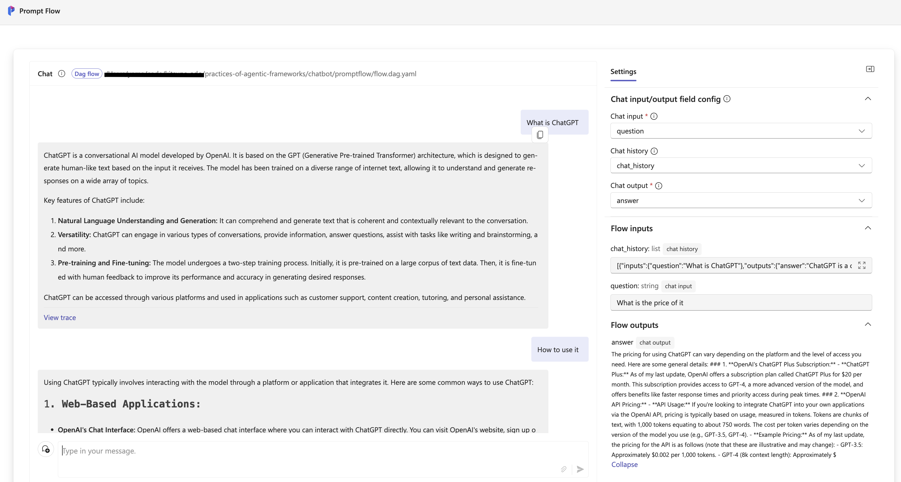

# Practices of Agentic Frameworks

## Introduction

AI Agent is an intelligent agent that uses large language models, combined with existing knowledge bases, APIs, and the coding capabilities of large language models. It has been proven that these intelligent agents can help us complete some complex tasks.

With the popularity of intelligent agents, in order to simplify their development, some open-source frameworks have emerged in the open-source community. Here we introduce some of the open-source frameworks and provide examples of common scenarios.


- [Promptflow](https://microsoft.github.io/promptflow/)
    > Prompt flow is a suite of development tools designed to streamline the end-to-end development cycle of LLM-based AI applications, from ideation, prototyping, testing, evaluation to production deployment and monitoring. It makes prompt engineering much easier and enables you to build LLM apps with production quality.

- [AutoGen](https://microsoft.github.io/autogen/)
    > AutoGen is an open-source programming framework for building AI agents and facilitating cooperation among multiple agents to solve tasks. AutoGen aims to provide an easy-to-use and flexible framework for accelerating development and research on agentic AI, like PyTorch for Deep Learning. It offers features such as agents that can converse with other agents, LLM and tool use support, autonomous and human-in-the-loop workflows, and multi-agent conversation patterns.s

- [TaskWeaver](https://microsoft.github.io/TaskWeaver/)
    > TaskWeaver is a code-first agent framework for seamlessly planning and executing data analytics tasks. This innovative framework interprets user requests through coded snippets and efficiently coordinates a variety of plugins in the form of functions to execute data analytics or workflow automation tasks.

 We will demonstrate the development practices of these frameworks in 
 - Chatbot
-  Function invocation
 - Task flow orchestration
 - Retrieval-Augmented Generation(RAG)
 - Code generation and execution

## Chatbot

### Promptflow

Here is [an example](https://github.com/microsoft/promptflow/tree/main/examples/flows/chat/chat-basic) of a basic chatbot using Promptflow. 


We can see that the application of Promptflow orchestrates the conversation flow through a yaml file. In this example, it contains two input items, the history of the conversation and the question, and an output item, which is the answer to the question.

```yaml
inputs:
  chat_history:
    type: list
    default: []
  question:
    type: string
    is_chat_input: true
    default: What is ChatGPT?
outputs:
  answer:
    type: string
    reference: ${chat.output}
    is_chat_output: true
```

It is an simple example, the whole flow only contains one node, which is a chat node. We name this node as 'chat', and the type is 'llm'.


The input of this node contains the parameters related to the LLM model, such as the model name, the maximum number of tokens, the temperature, etc., as well as the chat history and question passed from the previous node, which is the entrance of the conversation.


The source represents how the prompt of this node is generated, which is generated through a jinja2 template file here. Combined with the content of the yaml file, we can see how the template file generates the conversation. The jinja template uses two variables, chat_history and question, to generate the prompt.

```yaml
  inputs:
    deployment_name: gpt-4o
    model: gpt-4o
    max_tokens: "1024"
    temperature: "0.7"
    chat_history: ${inputs.chat_history}
    question: ${inputs.question}
  name: chat
  type: llm
  source:
    type: code

```yaml
  inputs:
    deployment_name: gpt-4o
    model: gpt-4o
    max_tokens: "1024"
    temperature: "0.7"
    chat_history: ${inputs.chat_history}
    question: ${inputs.question}
  name: chat
  type: llm
  source:
    type: code
    path: chat.jinja2
  api: chat
  connection: open_ai_connection
```

jinjia2 template

```jinja2
# system:
You are a helpful assistant.


# user:
{{item.inputs.question}}
# assistant:
{{item.outputs.answer}}


# user:
{{question}}
```

In this example, we use a connection configuration named open_ai_connection to configure the OpenAI link information.

In the local development environment, we can create it through the command-line tool provided by Promptflow.

Here is an example of creating a connection configuration with azure openai.

```shell
# Override keys with --set to avoid yaml file changes
pf connection create --file ../../connections/azure_openai.yml --set api_key=<your_api_key> api_base=<your_api_base> --name open_ai_connection
```

An example to create a connection configuration with openai.

```shell
# Override keys with --set to avoid yaml file changes
pf connection create --file ../../connections/openai.yml --set api_key=<your_api_key> --name open_ai_connection
```


The above command creates a connection configuration named open_ai_connection through a file named azure_openai.yml and our api_key and api_base.

```yaml
$schema: https://azuremlschemas.azureedge.net/promptflow/latest/AzureOpenAIConnection.schema.json
name: open_ai_connection
type: azure_open_ai
api_key: "<user-input>"
api_base: "aoai-api-endpoint"
api_type: "azure"
```


We also need a requirements.txt file to specify the dependencies.

```txt
promptflow
promptflow-tools
```

You can find the complete code example in this [directory](./chatbot/promptflow/).


Here is the complete command to start this chatbot.

```shell
# Create a virtual environment and install dependencies
python3 -m venv .venv
# Activate the virtual environment
source .venv/bin/activate
# Install dependencies
cd chatbot/promptflow
pip install -r requirements.txt
# Create the connection
pf connection create --file ../../connections/azure_openai.yml --set api_key=<your_api_key> api_base=<your_api_base> --name open_ai_connection
# Run the flow locally
pf flow test --flow . --interactive --ui
```

You can open the URL show in the console with your browser to interact with the chatbot.




