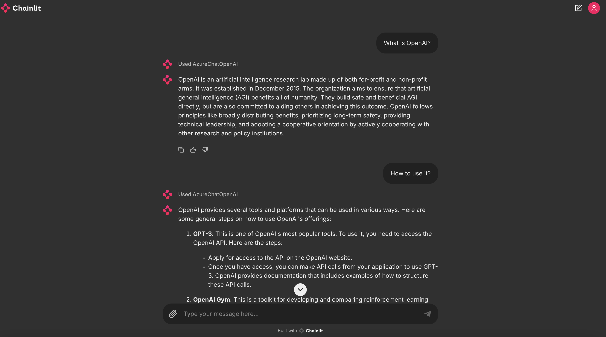

# Chatbot

## Promptflow

The application of Promptflow orchestrates the conversation flow through a yaml file which starts from an inputs node. In this example, it contains two input items, the history of the conversation and the question, and an output item, which is the answer to the question.

[flow.dag.yaml](./promptflow/flow.dag.yaml)
```yaml
inputs:
  chat_history:
    type: list
    default: []
  question:
    type: string
    is_chat_input: true
    default: What is ChatGPT?
outputs:
  answer:
    type: string
    reference: ${chat.output}
    is_chat_output: true
```

As below, the whole flow only contains one node, which is a chat node. We name this node as 'chat', and the type is 'llm'.

[flow.dag.yaml](./promptflow/flow.dag.yaml)
```yaml
  inputs:
    deployment_name: gpt-4
    model: gpt-4
    max_tokens: "1024"
    temperature: "0.7"
    chat_history: ${inputs.chat_history}
    question: ${inputs.question}
  name: chat
  type: llm
  source:
    type: code
    path: chat.jinja2
  api: chat
  connection: open_ai_connection
```

The input of this node contains the parameters related to the LLM model, such as the model name, the maximum number of tokens, the temperature, etc., as well as the chat history and question passed from the previous node, which is the entrance of the conversation.

The source item represents how the prompt of this node is generated, which is generated through a jinja2 template file here. Combined with the content of the yaml file, we can see how the template file generates the conversation. The jinja template uses two variables, chat_history and question, to generate the prompt.

[jinjia2 template](./promptflow/chat.jinja2)

```jinja2
# system:
You are a helpful assistant.


# user:
{{item.inputs.question}}
# assistant:
{{item.outputs.answer}}


# user:
{{question}}
```

In this example, we use a connection configuration named open_ai_connection to configure the OpenAI link information.

In the local development environment, we can create it through the command-line tool provided by Promptflow.

Here is an example of creating a connection configuration with Azure OpenAI.

```shell
# Override keys with --set to avoid yaml file changes
pf connection create --file ./connections/azure_openai.yml --set api_key=<your_api_key> api_base=<your_api_base> --name open_ai_connection
```

The above command creates a connection configuration named open_ai_connection through a file named azure_openai.yml and our api_key and api_base.

[azure_openai.yml](../connections/azure_openai.yml)
```yaml
$schema: https://azuremlschemas.azureedge.net/promptflow/latest/AzureOpenAIConnection.schema.json
name: open_ai_connection
type: azure_open_ai
api_key: "<user-input>"
api_base: "aoai-api-endpoint"
api_type: "azure"
```

Another example to create a connection configuration with OpenAI.

```shell
# Override keys with --set to avoid yaml file changes
pf connection create --file ./connections/openai.yml --set api_key=<your_api_key> --name open_ai_connection
```

We also need a requirements.txt file to specify the dependencies.

[requirements.txt](./promptflow/requirements.txt)
```txt
promptflow
promptflow-tools
```

You can find the complete code example in this [directory](./chatbot/promptflow/).

Here is the complete command to start this chatbot.

```shell
# Create a virtual environment and install dependencies
python3 -m venv .venv
# Activate the virtual environment
source .venv/bin/activate
# Install dependencies
cd chatbot/promptflow
pip install -r requirements.txt
# Create the connection
pf connection create --file ../../connections/azure_openai.yml --set api_key=<your_api_key>  api_base=<your_api_base> --name open_ai_connection
# Run the flow locally
pf flow test --flow . --interactive --ui
```

You can open the URL show in the console with your browser to interact with the chatbot.


Here is [an example](https://github.com/microsoft/promptflow/tree/main/examples/flows/chat/chat-basic) of a basic chatbot using Promptflow. 

## LangChain

Compared with Promptflow, LangChain is more code-oriented. In this example, the chatbot is implemented in a Python script. 

```python
llm = AzureChatOpenAI(
    openai_api_key=os.environ["OPENAI_API_KEY"],     
    openai_api_type=os.environ["OPENAI_API_TYPE"],
    openai_api_version=os.environ["OPENAI_API_VERSION"],
    azure_endpoint=os.environ["AZURE_OPENAI_ENDPOINT"],  
    deployment_name=os.environ["CHAT_MODEL_DEPLOYMENT_NAME"], 
    temperature=0,
)

prompt = ChatPromptTemplate.from_messages(
    [
        ("system", "You are smart agent to answer any question."),
        ("user", "{input}"),
    ]
)

chain = LLMChain(llm=llm, prompt=prompt, output_key="metrics")
res = chain({"input": "What is ChatGPT?"})
print(res["metrics"])
```

It initializes an AzureChatOpenAI object, which is a wrapper of the Azure OpenAI API. LangChain has good support for prompt generation. LLMChain is a class that can be used to chain the LLM model and the prompt together. 

And here is an experiment to integrate the LangChain chatbot with Promptflow, so that we can leverage Promptflow UI to run LangChain application.

With the Promptflow tool to make the LangChain chatbot as a task of the flow. You can find more information about the Promptflow tool in later chapters.

```python
# Create a MessagesPlaceholder for the chat history
history_placeholder = MessagesPlaceholder("history")

# Construct the prompt template
prompt_template = ChatPromptTemplate.from_messages([
    ("system", "You are smart agent to answer any question."),
    history_placeholder,
    ("user", "{input}")
])
    
@tool
def langhcian_task(question : str, chat_history : list) -> str:
    chain = LLMChain(llm=llm, prompt=prompt_template, output_key="metrics")
    res = chain({"input": question, "history": format_chat_history(chat_history)})
    return res["metrics"]
    
def format_chat_history(chat_history):
    formatted_chat_history = []
    for message in chat_history:
        if "inputs" in message:
            formatted_chat_history.append(("user", message["inputs"]["question"]))
        if "outputs" in message:
            formatted_chat_history.append(("system", message["outputs"]["answer"]))
    return formatted_chat_history
```

And the flow.dag.yml file is like this.

```yaml
$schema: https://azuremlschemas.azureedge.net/promptflow/latest/Flow.schema.json
environment:
  python_requirements_txt: requirements.txt
inputs:
  chat_history:
    type: list
    default: []
  question:
    type: string
    is_chat_input: true
    default: What is ChatGPT?
outputs:
  answer:
    type: string
    reference: ${langchain_task.output}
    is_chat_output: true
nodes:
- name: langchain_task
  type: python
  source:
    type: code
    path: langchain_task.py
  inputs:
    question: ${inputs.question}
    chat_history: ${inputs.chat_history}
```


Here is the command to start this chatbot which is the same as the Promptflow chatbot.

```shell
# Create a .env file and replace the placeholders with your own values
cp  .env.example .env
python3 -m venv .venv
# Activate the virtual environment
source .venv/bin/activate
# Install dependencies
cd chatbot/langchain
# Install dependencies
pip install -r requirements.txt
# Run the flow locally
pf flow test --flow . --interactive --ui
```

Meanwhile, we also create a chat UI with [Chainlit](https://docs.chainlit.io/integrations/langchain). Here is the code example.

> We will not introduce the details of Chainlit here. You can learn more about it in [the official documentation](https://docs.chainlit.io/get-started/overview).

- [chainlit_app.py](./chatbot/langchain/chainlit_app.py)

```python
from langchain_openai import AzureChatOpenAI
from langchain.prompts import ChatPromptTemplate
from langchain.schema import StrOutputParser
from langchain.schema.runnable import Runnable
from langchain.schema.runnable.config import RunnableConfig

import chainlit as cl

from dotenv import load_dotenv
load_dotenv()
import os

@cl.on_chat_start
async def on_chat_start():
    model = AzureChatOpenAI(
        deployment_name=os.environ["CHAT_MODEL_DEPLOYMENT_NAME"],
        openai_api_key=os.environ["OPENAI_API_KEY"],
        azure_endpoint=os.environ["AZURE_OPENAI_ENDPOINT"],        
        openai_api_type=os.environ["OPENAI_API_TYPE"],
        openai_api_version=os.environ["OPENAI_API_VERSION"],
        temperature=0,
        streaming=True
    )
    prompt = ChatPromptTemplate.from_messages(
        [
            (
                "system",
                """You are smart agent to answer any question.
                chat_history
                {chat_history}"""
            ),
            ("user", "{question}"),
            
        ]
    )
    runnable = prompt | model | StrOutputParser()
    cl.user_session.set("history",[])
    cl.user_session.set("runnable", runnable)


@cl.on_message
async def on_message(message: cl.Message):
    runnable = cl.user_session.get("runnable")  # type: Runnable

    msg = cl.Message(content="")
    history = cl.user_session.get("history") 
    
    history_str = ""
    for h in history:
        history_str += f"{h[0]}: {h[1]}\n"
        
    async for chunk in runnable.astream(
        {"question": message.content, "chat_history": history_str},
        config=RunnableConfig(callbacks=[cl.LangchainCallbackHandler()]),
    ):
        await msg.stream_token(chunk)

    await msg.send()    
    history.append(("user", message.content))
    history.append(("system", msg.content))


```
To run this UI, you can use the following command.

```shell
chainlit run chainlit_app.py -w
```



You can find the complete code example in this [directory](./chatbot/langchain/).

## LlamaIndex

The chatbot based on LlamaIndex is also implemented in a Python script. It is similar to LangChain.

```python
llm = AzureOpenAI(
    model="gpt-4o",
    deployment_name=os.environ["CHAT_MODEL_DEPLOYMENT_NAME"],
    api_key=os.environ["OPENAI_API_KEY"],
    azure_endpoint=os.environ["AZURE_OPENAI_ENDPOINT"],
    api_version=os.environ["OPENAI_API_VERSION"],
)

chat_engine = SimpleChatEngine.from_defaults(llm=llm)

response = chat_engine.chat(
    "What is ChatGPT?"
)
print(response)
```

And we can also integrate the LlamaIndex chatbot with Promptflow.

```python
llm = AzureOpenAI(
    model="gpt-4o",
    deployment_name=os.environ["CHAT_MODEL_DEPLOYMENT_NAME"],
    api_key=os.environ["OPENAI_API_KEY"],
    azure_endpoint=os.environ["AZURE_OPENAI_ENDPOINT"],
    api_version=os.environ["OPENAI_API_VERSION"],
)
    
chat_engine = SimpleChatEngine.from_defaults(llm=llm)

@tool
def llama_task(question : str) -> str:
    response = chat_engine.chat(
        question
    )
    return response.response
```

And the flow.dag.yml file is like this.

```yaml
$schema: https://azuremlschemas.azureedge.net/promptflow/latest/Flow.schema.json
environment:
  python_requirements_txt: requirements.txt
inputs:
  question:
    type: string
    is_chat_input: true
    default: What is ChatGPT?
outputs:
  answer:
    type: string
    reference: ${llamaindex_task.output}
    is_chat_output: true
nodes:
- name: llamaindex_task
  type: python
  source:
    type: code
    path: llamaindex_task.py
  inputs:
    question: ${inputs.question}
```

Here is the command to start this chatbot which is the same as the Promptflow and LangChain chatbot.

```shell
# Create a .env file and replace the placeholders with your own values
cp  .env.example .env
python3 -m venv .venv
# Activate the virtual environment
source .venv/bin/activate
# Install dependencies
cd chatbot/llamaindex
# Install dependencies
pip install -r requirements.txt
# Run the flow locally
pf flow test --flow . --interactive --ui
```

You may find the chatbot based on LlamaIndex supports chat history by default.

we also create a chat UI with [Chainlit](https://docs.chainlit.io/integrations/langchain). Here is the code example.

```python
import os
import chainlit as cl
from llama_index.llms.azure_openai import AzureOpenAI
from llama_index.core.chat_engine import SimpleChatEngine

llm = AzureOpenAI(
    model="gpt-4",
    deployment_name=os.environ["CHAT_MODEL_DEPLOYMENT_NAME"],
    api_key=os.environ["OPENAI_API_KEY"],
    azure_endpoint=os.environ["AZURE_OPENAI_ENDPOINT"],
    api_version=os.environ["OPENAI_API_VERSION"],
)

@cl.on_chat_start
async def start():
    chat_engine = SimpleChatEngine.from_defaults(llm=llm)
    chat_engine = cl.user_session.set("chat_engine", chat_engine)


@cl.on_message
async def main(message: cl.Message):
    chat_engine = cl.user_session.get("chat_engine") 
    response = chat_engine.stream_chat(message.content)
    msg = cl.Message(content="", author="Assistant")
    for token in response.response_gen:
         await msg.stream_token(token)
    await msg.send()
```

To run this UI, you can use the following command.

```shell
chainlit run chainlit_app.py -w
```

You can find the complete code example in this [directory](./chatbot/llamaindex/).