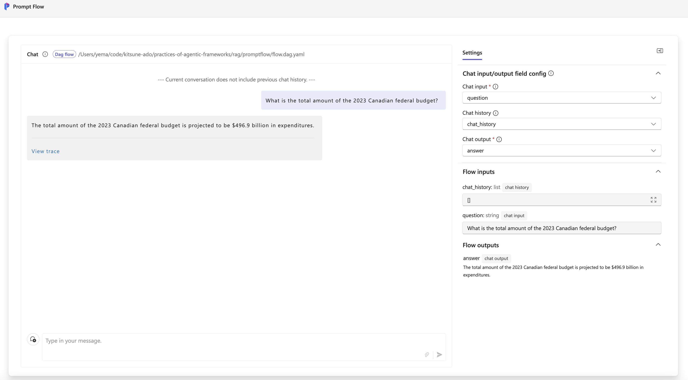
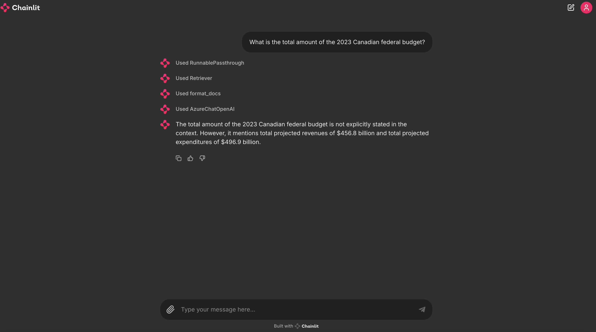

# RAG (Retrieval-Augmented Generation)

> Retrieval Augmented Generation (RAG) is an architecture that augments the capabilities of a Large Language Model (LLM) like ChatGPT by adding an information retrieval system that provides grounding data. Adding an information retrieval system gives you control over grounding data used by an LLM when it formulates a response. 

We will build an example named "chat with pdf" and ask a question as below:

__"What is the total amount of the 2023 Canadian federal budget?"__

The answer could be found in a pdf file named ["2023_canadian_budget.pdf"](../data/2023_canadian_budget.pdf).

### Promptflow

Here is a [link](https://github.com/microsoft/promptflow/blob/main/examples/flows/chat/chat-with-pdf/chat_with_pdf/README.md) to a full example of the RAG chatbot using Promptflow. 

We will implement a simple version of the RAG here. First, we need to make the pdf content vectorized and create a database to do similarity search. the result of the similarity search will be used as the context of the questions.

We use the OpenAI's text-embedding-ada-002 as embedding model and [FAISS](https://github.com/facebookresearch/faiss) as similarity search engine to complete this task.

```yaml
$schema: https://azuremlschemas.azureedge.net/promptflow/latest/Flow.schema.json
environment:
  python_requirements_txt: requirements.txt
inputs:
  chat_history:
    type: list
    default: []
  question:
    type: string
    is_chat_input: true
    default: What is the total amount of the 2023 Canadian federal budget?
outputs:
  answer:
    type: string
    is_chat_output: true
    reference: ${chat.output}
nodes:
- name: find_context
  type: python
  source:
    type: code
    path: find_context.py
  inputs:
    question: ${inputs.question}
- name: chat
  type: llm
  source:
    type: code
    path: chat.jinja2
  inputs:
    deployment_name: gpt-4
    model: gpt-4
    max_tokens: "1024"
    temperature: "0"
    chat_history: ${inputs.chat_history}
    question: ${inputs.question}
    context: ${find_context.output}
  connection: open_ai_connection
  api: chat
```

We add a node named find_context_tool to find the context of the question. And the put the context into the chat node as the context parameter.

```python
from pdf_index import create_faiss_index, query_text

pdf_path = "../../data/2023_canadian_budget.pdf"
index = create_faiss_index(pdf_path)

@tool
def find_context_tool(question: str)->list:
    result = query_text(index=index, text=question, top_k=5)
    return [c.text for c in result]
```

You can find the pdf_index.py file [here](./promptflow/pdf_index.py). To save space, we only show the key code here.

```jinja2
# system:
You are a helpful assistant. You can answer questions with the context provided. 
The context is a list of strings that may or may not be relevant to the question. 
You need to choose the relevant context to answer the question and rephrase it in your answer.

# chat history

## user:
{{item.inputs.question}}
## assistant:
{{item.outputs.answer}}


# context

## context:
{{ctx}}


# user:
{{question}}
```

The above is the jinja2 template file to build the prompt where we can see the context and chat history are added to the prompt.

To run this example, we need to create a connection configuration with OpenAI.

```shell
pf connection create --file ./connections/azure_openai.yml --set api_key=<your_api_key> api_base=<your_api_base> --name open_ai_connection
pf flow test --flow . --interactive --ui
```



You can find the complete code example in this [directory](./promptflow/).

### LangChain

LangChain has a good community support of FAISS. We can write less code to implement the RAG with the same FAISS indexing. 

Here is the [python file](langchain/langchain_indexing.py) to create the FAISS index in LangChain. 

And the Promptflow tool is like this.

```python
pdf_path = "../../data/2023_canadian_budget.pdf"
vectorstore = create_faiss_index(pdf_path)

@tool
def query(question: str) -> str:

    retriever = vectorstore.as_retriever()

    # Define the template string
    template_string = """
    You are an assistant for question-answering tasks. Use the following pieces of retrieved context to answer the question. 
    If you don't know the answer, just say that you don't know. Use three sentences maximum and keep the answer concise.

    Context:
    {context}

    Question:
    {question}

    Answer:
    """

    # Format the prompt with the context and question
    prompt = ChatPromptTemplate(
        input_variables=['context', 'question'], 
        messages=[
            HumanMessagePromptTemplate(prompt=PromptTemplate(
                input_variables=['context', 'question'], 
                template=template_string))])

    def format_docs(docs):
        return "\n\n".join(doc.page_content for doc in docs)


    rag_chain = (
        {"context": retriever | format_docs, "question": RunnablePassthrough()}
        | prompt
        | model
        | StrOutputParser()
    )

    return rag_chain.invoke(question)
```

Logically, the code is similar to the Promptflow example. In this example, we leverage the LangChain Expression Language (LCEL) which is a special language to define the flow in LangChain. You can find more information about LCEL in the [official documentation](https://python.langchain.com/v0.1/docs/expression_language/why/).

Here is the command to start this example.

```shell
pf flow test --flow . --interactive --ui
```

And [here](./langchain/app.py) is a Chainlit UI implementation.



You can find the complete code example in this [directory](./rag/langchain/).

### LlamaIndex

LlamaIndex has a more straightforward way to implement the RAG chatbot. It support a built-in indexing mechanism to support the RAG.

LlamaIndex provides a [SimpleDirectoryReader](https://docs.llamaindex.ai/en/stable/api_reference/readers/simple_directory_reader/) to read the files and a [VectorStoreIndex](https://docs.llamaindex.ai/en/stable/module_guides/indexing/vector_store_index/) to index the files. It also need an embed_model to vectorize the text.

```python
reader = SimpleDirectoryReader(DATA_PATH)
documents = reader.load_data()
index = VectorStoreIndex.from_documents(
    documents, embed_model=embed_model, transformations=[text_splitter], show_progress=True
)
index.storage_context.persist(persist_dir=INDEX_PATH)
```

Meanwhile, LlamaIndex provides [QueryEngine](https://ts.llamaindex.ai/modules/query_engines/) to retrieve the context and generate the response. It is to simplify the process of building a RAG chatbot.

```python
@tool
def query(question: str, is_index: str) -> str:
    # rebuild storage context
    storage_context = StorageContext.from_defaults(persist_dir=INDEX_PATH)

    # load index
    index = load_index_from_storage(storage_context)

    retriever = VectorIndexRetriever(
        index=index,
        similarity_top_k=10,
        embed_model=embed_model,
    )

    # configure response synthesizer
    response_synthesizer = get_response_synthesizer()

    # assemble query engine
    query_engine = RetrieverQueryEngine(
        retriever=retriever,
        response_synthesizer=response_synthesizer,
        node_postprocessors=[SimilarityPostprocessor(similarity_cutoff=0.7)],
    )
    response = query_engine.query(question)

    return response.response
```

Chainlit implementation can be found [here](./rag/llamaindex/app.py).
> Known Issue: 'ChatCompletionChunk' object has no attribute 'get'. https://github.com/Chainlit/chainlit/issues/1178

You can find the complete code example in this [directory](./rag/llamaindex/).


